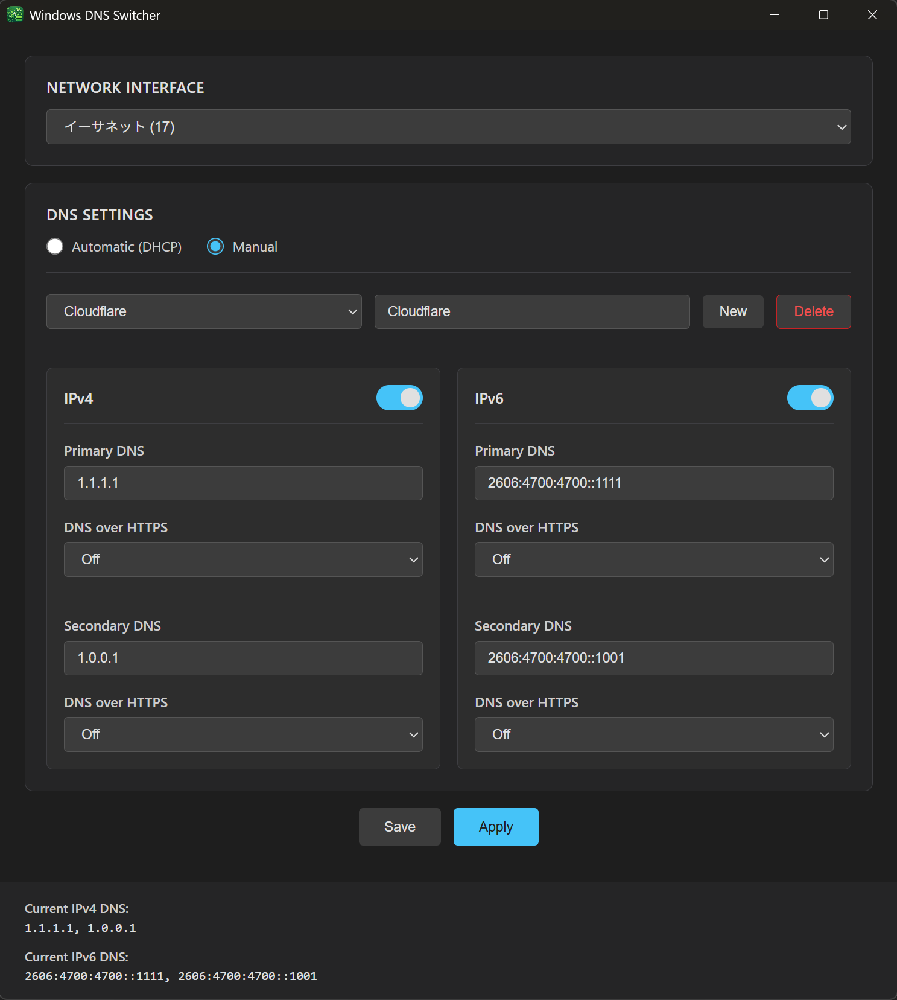

# Windows DNS Switcher

A GUI tool to switch Windows 11 DNS settings between Automatic and Manual modes. Supports IPv4/IPv6 and manages multiple DNS profiles.

## Features

- **Multiple DNS Modes**: Automatic (DHCP) and Manual configuration support.
- **IPv4 and IPv6 Support**: Separate configuration for each protocol; enable or disable them independently.
- **Network Interface Management**: Automatically detects active network interfaces and allows switching between adapters.
- **DNS Profiles**: Save multiple DNS configurations as profiles and switch between them easily.
- **Settings Persistence**: Saves your profiles and window state to a JSONC configuration file.
- **Modern UI**: Dark theme with a clean interface and real-time DNS status display.

## Requirements

- Windows 11 (or Windows 10 with PowerShell 5.1+)
- Administrator privileges (required for DNS changes)

## Usage

1. Run the application as Administrator.
2. Select your network interface from the dropdown.
3. Manage profiles:
   - **New**: Click the "New" button to create a new DNS profile.
   - **Select**: Choose an existing profile from the dropdown menu.
   - **Delete**: Click the "Delete" button to remove the currently selected profile.
4. Choose DNS mode:
   - **Automatic**: Use DHCP-provided DNS servers.
   - **Manual**: Set custom DNS servers.
5. Configure IPv4 and/or IPv6 DNS settings as needed.
6. Click **Apply** to apply the current settings to the system DNS configuration.
7. Click **Save** to save the profile settings to the configuration file without applying them to the system.

## DNS Configuration

### DNS Profiles
Profiles allow you to store different sets of DNS configurations (e.g., "Work", "Home", "Public DNS"). You can quickly switch between these sets without re-entering IP addresses.

### Manual Mode & DoH (DNS over HTTPS)
1. Enable IPv4 or IPv6 (or both).
2. Enter the primary and secondary DNS server addresses.
3. Configure DoH for each server:
   - DoH can be set to **Off** or **On** for each DNS server (primary/secondary).
   - When DoH is **On**, a template URL is required (e.g., `https://cloudflare-dns.com/dns-query`).
4. Click **Apply** to update your network adapter settings.

## License

This project is licensed under the MIT License. See the [LICENSE](LICENSE) file for details.

## Notes

- Administrator privileges are required because DNS settings modification requires elevated permissions.
- DNS cache is automatically cleared after every settings change.
- The application only shows active network interfaces.
